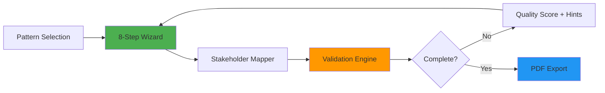

# LFA Builder - Hackathon MVP

> **Pitch:** "Design a funder-ready program framework in 4 hours instead of 4 months"

## Problem Recap

NGOs struggle to design clear programs. Current process is slow, expensive, expert-dependent. **Our solution:** Guided workflow + pattern library + validation engine + export.

**Target impact:** 60% reduction in design effort.

---

## 🎯 Hackathon MVP Scope (Jan 22 Deadline)

### ✅ Build Fully (Core Features)

| # | Feature | Why Critical | Complexity |
|---|---------|--------------|-----------|
| 1 | **8-step Guided Workflow** | This IS the product. Non-negotiable. | High |
| 2 | **Stakeholder Mapping Tool** | System-level thinking. Wows judges. | High |
| 3 | **Input Validation Engine** | Shows intelligence, not just form-filling. | Medium |
| 4 | **PDF Export** | Tangible output. Perfect demo ending. | Medium |

### 🟡 Build Light (Partial Implementation)

| # | Feature | Scope | Why Not Full |
|---|---------|-------|--------------|
| 5 | FLN Template | 1 template only | Quality > quantity |
| 6 | Pattern Library | 10-12 patterns | Judges care about linkage, not count |
| 7 | Indicator Library | 20-30 indicators | Enough to show rigor |
| 8 | Save & Resume | Local storage only | No auth needed for demo |
| 9 | Responsive Design | Desktop-first | Basic mobile OK |

### ❌ Explicitly Defer (Mention as V2)

- AI chatbot/suggestions (LLM hype distraction)
- Gamification mechanics (badges, points)
- Real-time collaboration
- User auth & org management
- Multi-language / offline mode

---

## 🏆 Killer Combo Strategy

**Combo:** Guided Workflow + Pattern Library + Validation + Export

**User Journey:**
1. Start with a proven pattern (FLN)
2. Guided questions ensure completeness
3. Logic checks validate coherence
4. One-click funder-ready PDF

**Value Proposition:** "From vague idea to validated LFA document in one sitting"

---

## Core Architecture



### Data Flow

```javascript
// Core state structure
{
  step: 1-8,
  theme: "FLN",
  pattern: "Reading_Comprehension_Boost",
  data: {
    problem: "...",
    outcomes: [...],
    indicators: [...],
    intervention: "...",
    stakeholders: {
      school: [{ role: "Teacher", practices: [...] }],
      cluster: [{ role: "CRP", practices: [...] }],
      // ...
    }
  },
  validation: {
    score: 85,
    issues: [...]
  }
}
```

---

## 8-Step Workflow Breakdown

| Step | Question | Input Type | Validation |
|------|----------|------------|------------|
| 1 | **Context** | Theme selection (FLN/Custom) | Required |
| 2 | **Problem Statement** | Text area + examples | Min 50 chars |
| 3 | **Student Outcomes** | Multi-select + custom | Min 1 outcome |
| 4 | **Outcome Indicators** | Searchable library + custom | Each outcome needs ≥1 indicator |
| 5 | **Intervention Approach** | Pattern picker + description | Required |
| 6 | **Stakeholder Mapping** | Hierarchical multi-select | Min 2 levels |
| 7 | **Practice Changes** | Per-stakeholder action cards | Each stakeholder needs ≥1 practice |
| 8 | **Tracking Plan** | Indicator-practice alignment | All practices mapped |

---

## Stakeholder Mapping Tool

**Visual Hierarchy:**

```
┌───────────────────────────────────────┐
│ DISTRICT  [+]                         │
│   ├─ DEO                              │
│   ├─ DIET                             │
│   └─ DM                               │
├───────────────────────────────────────┤
│ BLOCK  [+]                            │
│   ├─ BRP   → Practice: Monthly visits │
│   ├─ BRCC                             │
│   └─ BEO                              │
├───────────────────────────────────────┤
│ SCHOOL  [+]                           │
│   ├─ Teacher → Practice: Daily FLN    │
│   ├─ HM                               │
│   └─ Student                          │
└───────────────────────────────────────┘
```

**Features:**
- Collapsible hierarchy
- Drag-drop to add stakeholders
- Inline practice entry
- Color-coded by level

---

## Validation Engine Rules

| Rule | Check | Flag |
|------|-------|------|
| **Completeness** | All steps filled | ⚠️ "Step 3 incomplete" |
| **Logic** | Outcome without indicator | 🚫 "No way to measure this outcome" |
| **Coherence** | Stakeholder without practice change | 🚫 "What should they do differently?" |
| **Alignment** | Practice without tracking indicator | ⚠️ "How will you know this practice happened?" |

**Quality Score:**
```
Score = (completeness × 40%) + (logic × 30%) + (coherence × 30%)
```

---

## Pattern Library Structure

### FLN Theme - Sample Patterns

| Pattern | Pre-filled Data |
|---------|-----------------|
| **Reading Comprehension Boost** | Outcomes: Grade-level reading by X%, Indicators: ORF scores, ASER levels, Stakeholders: Teachers, CRPs |
| **Numeracy Foundations** | Outcomes: Basic arithmetic mastery, Indicators: Mental math speed, Problem-solving accuracy |
| **Phonics Intervention** | Focus: Early grades, Practice changes: Daily 15-min phonics drills |

**Pattern JSON Schema:**
```json
{
  "id": "fln_reading_boost",
  "theme": "FLN",
  "problem": "Students in Grades 3-5 cannot read grade-level text",
  "outcomes": ["Reading at grade level", "Improved comprehension"],
  "indicators": ["ORF score ≥ 45 wpm", "ASER Reading Level 2+"],
  "stakeholders": {
    "school": ["Teacher", "HM"],
    "cluster": ["CRP"]
  }
}
```

---

## Indicator Library Structure

**Categories:**
- Student Learning (reading, numeracy, SEL)
- Teacher Practice (pedagogy, assessment)
- System Functioning (attendance, infrastructure)

**Sample Indicators (20-30 total):**

| Indicator | Category | Measurement |
|-----------|----------|-------------|
| ORF (Oral Reading Fluency) | Student Learning | Words per minute |
| ASER Reading Level | Student Learning | Level 0-4 |
| Daily FLN instruction time | Teacher Practice | Minutes/day |
| CRP mentoring visit frequency | System | Visits/month |

---

## PDF Export Template

**Sections:**
1. **Cover Page** - Program name, org, date
2. **Problem Statement** - Context and challenge
3. **Theory of Change** - Visual logic model
4. **Stakeholder Map** - Who does what
5. **Measurement Framework** - Indicators table
6. **Appendix** - Assumptions, risks

**Tech:** jsPDF + HTML template

---

## Tech Stack (Finalized)

| Layer | Choice | Why |
|-------|--------|-----|
| **Framework** | Next.js 14 | Pages router, easy deployment |
| **Styling** | Tailwind CSS | Speed |
| **State** | Zustand | Lightweight, persistent |
| **Icons** | Lucide React | Clean, consistent |
| **Export** | jsPDF | Client-side PDF generation |
| **Storage** | LocalStorage | No backend needed for MVP |
| **Deploy** | Vercel | One-click, fast |

---

## Folder Structure

```
lfa-builder/
├── public/
│   ├── patterns/          # JSON pattern files
│   └── indicators/        # Indicator library
├── src/
│   ├── app/
│   │   ├── page.tsx       # Landing page
│   │   └── wizard/        # Main wizard
│   ├── components/
│   │   ├── StepWizard.tsx
│   │   ├── StakeholderMap.tsx
│   │   ├── ValidationPanel.tsx
│   │   ├── ProgressBar.tsx
│   │   └── PDFExport.tsx
│   ├── store/
│   │   └── lfaStore.ts    # Zustand store
│   ├── lib/
│   │   ├── validation.ts
│   │   └── pdfGenerator.ts
│   └── types/
│       └── index.ts
└── package.json
```

---

## Development Timeline (5 days to demo)

| Day | Focus | Deliverable |
|-----|-------|-------------|
| **Day 1** | Setup + Step 1-3 | Basic wizard flow |
| **Day 2** | Step 4-8 | Complete workflow |
| **Day 3** | Stakeholder mapper + validation | Core logic |
| **Day 4** | PDF export + polish | End-to-end demo |
| **Day 5** | Testing + presentation | Demo-ready |

---

## Evaluation Criteria Alignment

| Criteria | Weightage | Our Approach | Score Target |
|----------|-----------|--------------|--------------|
| **Technical** | 35% | Open-source (GitHub), scalable (Vercel), configurable (patterns) | 30/35 |
| **Creativity** | 20% | Validation engine + stakeholder mapping innovation | 18/20 |
| **UX** | 20% | Step-by-step wizard, live preview, quality score | 18/20 |
| **Completeness** | 20% | Full flow: pattern → design → validate → export | 19/20 |
| **Presentation** | 5% | Live demo with real FLN example | 5/5 |

**Target:** 90/100

---

## Demo Script (5 minutes)

1. **Hook (30s):** "Designing a program today takes 4 months. We did it in 4 minutes."
2. **Problem (30s):** Show blank-page frustration, consultant dependency
3. **Solution walkthrough (3min):**
   - Select FLN pattern
   - Walk through 8 steps (fast-forward middle steps)
   - Show stakeholder map
   - Trigger validation (show red flags → green)
   - Export PDF live
4. **Impact (30s):** "60% faster, zero consultants, funder-ready"
5. **Roadmap (30s):** V2 features (AI, collaboration)

---

## Defense Strategy

**Judge:** "Why no AI?"  
**Us:** "AI is V2. We prioritized end-to-end completeness over buzzwords. Our validation engine already provides intelligent guidance."

**Judge:** "Only 1 template?"  
**Us:** "We built 1 template deeply rather than 3 shallowly. It proves extensibility without cutting corners."

**Judge:** "What about collaboration?"  
**Us:** "Hackathon MVP proves the concept. Collaboration is planned for V2 after user feedback."

---

## Success Metrics (Post-Hackathon)

| Metric | Target |
|--------|--------|
| Design completion time | 4 hours (vs. 4 months) |
| Validation score | ≥ 80% before export |
| Template reuse rate | 70%+ start with patterns |
| Funder acceptance | LFA accepted without revisions |

---

## Next Steps

1. **Initialize project** (`npx create-next-app@latest`)
2. **Build wizard skeleton** (8 empty steps)
3. **Implement validation engine**
4. **Create FLN pattern + indicators**
5. **Build stakeholder mapper**
6. **Test end-to-end flow**
7. **Polish UI + export**
8. **Prepare 5-min demo**
